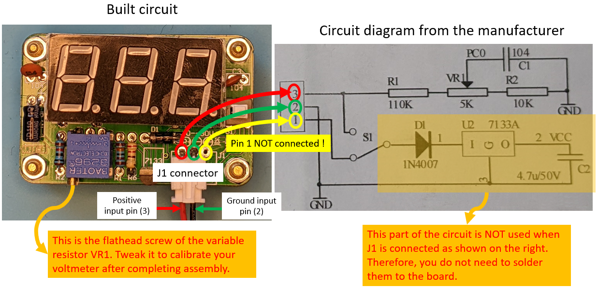

# Project Cheap and Practical Voltmeter

#ID:23102
---
This project is about building a small voltmeter to help you measure DC voltages between 0V and 30V at a resolution of 0.1V in your projects. If you do not need an expensive multimeter and simply want to monitor voltages every now and then, this kit is perfect for you and is very cheap. **[Follow this link][1]** if you would like to get and build one for yourself (costs $9.49 at the time of writing)

This is an easy one to build but there are a few notes of caution you need to be aware of to avoid any frustration (see Project Challenges)

There are 2 pages of instructions provided by the manufacturer. You can access those using the following links:

**[1 - Instruction page 1 of 2][2]**

**[2 - Instruction page 2 of 2][3]**

Project Challenges
---

The most critical part of the project is how to connect J1 using the 2-pin connector provided. There are two ways this connector can be solderes BUT only one of those connections works. The working connections is explained in the diagram below. Basically, you need to flush the J1 connector to left leaving pin 1 on the PCB unconnected. This will also allow you to use the switch (i.e., S1) to power the kit on or off at will.

If you connect J1 the other way round, you will see the digital display constantly indicating 0.0V.

Once you get the kit working, connect it to a DC supply with a known voltage output between 0 and 30V. The chances are the digital display will read a different voltage than what you expect. If this is the case, simply use a flathead screwdriver and adjust the variable resistor (i.e., VR1) until the display shows the same voltage as the DC power supply (refer to above figure for help). After this step your kit will be calibrated and you can use it to measure DC voltages !

Quick Tips
---
**1 -** While soldering the alligator clips, take your time and heat each clip long enough for the solder to adhere to the clip.

**2 -** While trying to fit the microcontroller into the socket, bend the pins slightly inwards to achieve an easier fit without damaging the pins.

**3 -** After soldering the microcontroller socket in place, cut off the excess pins on the other side of the PCB so that the digital display will fit into the holes as required.

Purchase Links
---
**[1 - Buy this complete project kit from Amazon][1]**

[1]: https://amzn.to/3pF0vFr
[2]: /instructions_pg_1_of_2.jpg
[3]: /instructions_pg_2_of_2.jpg